# FinAI — Technical Architecture Diagram

## System Overview

```mermaid
flowchart TB
    %% ─────────────────────────────────────────────
    %% EXTERNAL DATA SOURCES
    %% ─────────────────────────────────────────────
    subgraph EXT["🌐 External Data Sources"]
        YF["📈 Yahoo Finance\n(yfinance)\nOHLCV · 10 tickers"]
        NA["📰 NewsAPI\nFinancial headlines"]
        RSS["📡 RSS Feeds\nFinancial news streams"]
    end

    %% ─────────────────────────────────────────────
    %% DATA INGESTION LAYER
    %% ─────────────────────────────────────────────
    subgraph ING["📥 Data Ingestion  ·  finai/data/"]
        SF["stock_fetcher.py\n• 4 h disk cache (pickle)\n• Retry logic (3×)\n• Parquet persistence"]
        NF["news_fetcher.py\n• RSS + NewsAPI fusion\n• URL deduplication\n• 2 h cache TTL"]
    end

    %% ─────────────────────────────────────────────
    %% STORAGE
    %% ─────────────────────────────────────────────
    subgraph STORE["🗄️ Local Storage"]
        CACHE["Cache Store\n(pickle, TTL-aware)"]
        RAW["Raw Data Store\n(Parquet)"]
        PROC["Processed Feature Store\n(Parquet)"]
        MSTORE["Model Store\n(joblib — .pkl)"]
        CHROMA["ChromaDB\nVector Store"]
    end

    %% ─────────────────────────────────────────────
    %% FEATURE ENGINEERING
    %% ─────────────────────────────────────────────
    subgraph FE["⚙️ Feature Engineering  ·  finai/features/"]
        TI["technical_indicators.py\n25+ indicators:\nRSI · MACD · Bollinger Bands\nATR · OBV · VWAP · Stochastic\nROC · Historical Volatility\nSMA/EMA (10/20/50)"]
        SENT["sentiment_features.py\nFinBERT (HuggingFace)\n→ VADER fallback\nPer-ticker daily aggregation"]
        FP["feature_pipeline.py\nOrchestrator:\nfetch → indicators → sentiment\n→ target label → scale → persist"]
        SCALER["RobustScaler\n(scikit-learn)\nFit on train, applied on test"]
    end

    %% ─────────────────────────────────────────────
    %% ML TRAINING
    %% ─────────────────────────────────────────────
    subgraph ML["🤖 ML Pipeline  ·  finai/models/"]
        XGB["XGBoost Classifier\n• Binary: price up/down\n• Class weight balancing\n• Early stopping"]
        LGBM["LightGBM Classifier\n• Binary: price up/down\n• Class weight balancing\n• Early stopping"]
        OPTUNA["Optuna\nHyperparameter Tuning\n30 trials per model"]
        ENS["Soft-Voting Ensemble\nXGBoost + LightGBM"]
        TSCV["TimeSeriesSplit CV\n(no shuffle — leak-free)\n5 folds"]
        PRED["predictor.py\n→ Probability scores\n→ BUY / HOLD / SELL signals"]
    end

    %% ─────────────────────────────────────────────
    %% MLOPS
    %% ─────────────────────────────────────────────
    subgraph MLOPS["📊 MLOps  ·  MLflow"]
        MLF["MLflow Tracking Server\n(port 5000)\n• Params · Metrics\n• Feature importance\n• Classification reports\n• Artifacts"]
        REG["MLflow Model Registry\nVersioned model promotion"]
    end

    %% ─────────────────────────────────────────────
    %% RAG PIPELINE
    %% ─────────────────────────────────────────────
    subgraph RAG["🧠 RAG Pipeline  ·  finai/rag/"]
        EMB["Sentence Transformers\nall-MiniLM-L6-v2\n384-dim embeddings"]
        DS["document_store.py\n• ChromaDB persistence\n• Cosine similarity search\n• URL deduplication\n• Top-K retrieval"]
        CHAIN["rag_chain.py\n• Context assembly (top-5)\n• Prompt engineering\n• Citation extraction"]
        LLM["LLM Backends\nPrimary: OpenAI GPT-4o-mini\nFallback: Anthropic Claude\nOffline: context-only mode"]
    end

    %% ─────────────────────────────────────────────
    %% MONITORING
    %% ─────────────────────────────────────────────
    subgraph MON["🔍 Monitoring  ·  finai/monitoring/"]
        DD["drift_detector.py\n• Kolmogorov-Smirnov test\n  (p-value threshold 0.05)\n• PSI score (bins=10)\n  moderate >0.1  significant >0.2\n• Per-feature reporting"]
        PT["performance_tracker.py\n• Rolling accuracy snapshots\n• ROC-AUC over time"]
    end

    %% ─────────────────────────────────────────────
    %% DASHBOARD
    %% ─────────────────────────────────────────────
    subgraph DASH["🖥️ Streamlit Dashboard  ·  finai/dashboard/  (port 8501)"]
        HOME["app.py\nHome — Market Snapshot\n10-ticker overview"]
        P1["Stock Analysis\nCandlestick · SMA/EMA\nBollinger Bands · RSI\nMACD · Volume · News"]
        P2["ML Predictions\nOn-demand training\nSignal overlay\nFeature importance"]
        P3["AI Chatbot\nRAG-powered Q&A\nSource citations"]
        P4["MLflow Tracker\nRun browser\nMetric charts\nModel Registry"]
        P5["Monitoring\nDrift report · PSI chart\nPerformance history"]
    end

    %% ─────────────────────────────────────────────
    %% CONFIGURATION & CROSS-CUTTING
    %% ─────────────────────────────────────────────
    subgraph CFG["🔧 Cross-Cutting Concerns"]
        SETTINGS["config/settings.py\nPydantic config\n.env loading\nAPI keys · paths · defaults"]
        LOG["utils/logger.py\nloguru structured logging\nFile rotation"]
        CI["GitHub Actions CI\nPytest on Python 3.11 & 3.12"]
    end

    %% ─────────────────────────────────────────────
    %% EDGES — Data Ingestion
    %% ─────────────────────────────────────────────
    YF -->|OHLCV| SF
    NA -->|headlines| NF
    RSS -->|articles| NF
    SF <-->|read/write| CACHE
    SF -->|persist| RAW
    NF -->|articles| FP

    %% Feature Engineering
    RAW -->|OHLCV DataFrame| FP
    FP --> TI
    FP --> SENT
    TI -->|indicator columns| FP
    SENT -->|sentiment scores| FP
    FP --> SCALER
    SCALER -->|scaled features + targets| PROC

    %% ML Training
    PROC -->|train/test split| TSCV
    TSCV --> XGB
    TSCV --> LGBM
    OPTUNA -->|best params| XGB
    OPTUNA -->|best params| LGBM
    XGB --> ENS
    LGBM --> ENS
    ENS -->|serialized| MSTORE
    XGB -->|metrics & artifacts| MLF
    LGBM -->|metrics & artifacts| MLF
    MLF --> REG

    %% Inference
    MSTORE -->|load models| PRED
    PROC -->|latest features| PRED

    %% RAG
    NF -->|raw articles| EMB
    EMB -->|vectors| DS
    DS <-->|persist/query| CHROMA
    DS -->|top-5 context docs| CHAIN
    PRED -->|signals + probs| CHAIN
    CHAIN --> LLM
    LLM -->|answer + citations| CHAIN

    %% Monitoring
    PROC -->|reference distribution| DD
    PROC -->|current distribution| DD
    PRED -->|prediction history| PT

    %% Dashboard
    SF -->|live OHLCV| P1
    TI -->|indicator data| P1
    NF -->|news feed| P1
    PRED -->|signals| P2
    MLF -->|run data| P4
    REG -->|registered models| P4
    CHAIN -->|Q&A response| P3
    DD -->|drift report| P5
    PT -->|perf history| P5
    HOME --- P1
    HOME --- P2
    HOME --- P3
    HOME --- P4
    HOME --- P5

    %% Cross-cutting
    SETTINGS -.->|config| ING
    SETTINGS -.->|config| FE
    SETTINGS -.->|config| ML
    SETTINGS -.->|config| RAG
    LOG -.->|logging| ING
    LOG -.->|logging| FE
    LOG -.->|logging| ML

    %% ─────────────────────────────────────────────
    %% STYLES
    %% ─────────────────────────────────────────────
    classDef ext      fill:#1e3a5f,stroke:#4a9eff,color:#cce4ff
    classDef ingestion fill:#1a3d2b,stroke:#3dba6f,color:#c8f0d8
    classDef storage  fill:#3d2a1a,stroke:#e0884a,color:#fde8cc
    classDef features fill:#2a1a3d,stroke:#9b6fe0,color:#e8d8ff
    classDef mlpipe   fill:#3d1a1a,stroke:#e05050,color:#ffd8d8
    classDef mlops    fill:#1a3d3d,stroke:#3dbaba,color:#c8f0f0
    classDef ragpipe  fill:#1a2b3d,stroke:#4a7ec8,color:#d0e8ff
    classDef monitor  fill:#3d3a1a,stroke:#d4c030,color:#f8f0cc
    classDef dash     fill:#2a3d1a,stroke:#70c040,color:#ddf0c8
    classDef cfg      fill:#2a2a2a,stroke:#888888,color:#dddddd

    class YF,NA,RSS ext
    class SF,NF ingestion
    class CACHE,RAW,PROC,MSTORE,CHROMA storage
    class TI,SENT,FP,SCALER features
    class XGB,LGBM,OPTUNA,ENS,TSCV,PRED mlpipe
    class MLF,REG mlops
    class EMB,DS,CHAIN,LLM ragpipe
    class DD,PT monitor
    class HOME,P1,P2,P3,P4,P5 dash
    class SETTINGS,LOG,CI cfg
```



---

## Component Reference

| Layer | Module | Key Responsibility |
|---|---|---|
| **Data Ingestion** | `finai/data/stock_fetcher.py` | OHLCV download with 4 h TTL cache & retry |
| **Data Ingestion** | `finai/data/news_fetcher.py` | RSS + NewsAPI aggregation with deduplication |
| **Feature Eng.** | `finai/features/technical_indicators.py` | 25+ indicators (RSI, MACD, BBands, ATR, …) |
| **Feature Eng.** | `finai/features/sentiment_features.py` | FinBERT sentiment → per-ticker daily scores |
| **Feature Eng.** | `finai/features/feature_pipeline.py` | End-to-end pipeline orchestrator |
| **ML Models** | `finai/models/trainer.py` | XGBoost + LightGBM + Optuna + MLflow |
| **ML Models** | `finai/models/predictor.py` | Inference → BUY / HOLD / SELL signals |
| **RAG** | `finai/rag/document_store.py` | ChromaDB vector store + semantic search |
| **RAG** | `finai/rag/rag_chain.py` | Context retrieval + LLM generation |
| **Monitoring** | `finai/monitoring/drift_detector.py` | KS-test + PSI per feature |
| **Monitoring** | `finai/monitoring/performance_tracker.py` | Rolling accuracy & AUC snapshots |
| **Dashboard** | `finai/dashboard/app.py` + `pages/` | 5-page Streamlit UI (port 8501) |
| **Config** | `finai/config/settings.py` | Pydantic config + `.env` loading |
| **MLflow** | Tracking server (port 5000) | Experiment runs, Model Registry |

## Data Flow Summary

```
External APIs (yfinance · NewsAPI · RSS)
        │
        ▼
  Ingestion Layer  ──→  Cache (TTL) + Raw Parquet Store
        │
        ▼
Feature Engineering  ──→  25 tech indicators + FinBERT sentiment
        │                   + target label + RobustScaler
        ▼
  Processed Parquet Store
        │
   ┌────┴─────────────────────────┐
   ▼                              ▼
ML Pipeline                  RAG Pipeline
XGBoost + LightGBM           ChromaDB + MiniLM embeddings
Optuna tuning (30 trials)    OpenAI GPT-4o-mini / Claude
TimeSeriesSplit CV           Context-aware financial Q&A
Soft-voting ensemble
MLflow tracking
        │
        ▼
  Monitoring Layer
  KS-test · PSI drift detection
  Rolling accuracy & AUC
        │
        ▼
  Streamlit Dashboard  (port 8501)
  Stock Analysis · ML Predictions · AI Chatbot
  MLflow Tracker · Monitoring
```
